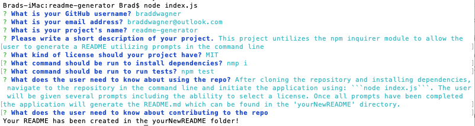

# readme-generator
  [](https://opensource.org/licenses/MIT)

  ## Description
  This project untilizes the npm inquirer module to allow the user to generate a README utilizing prompts in the command line

  ## Table of Contents

  ♦︎[Installation](#installation)

  ♦︎[Usage](#usage)

  ♦︎[Contributing](#contributing)

  ♦︎[Tests](#tests)

  ♦︎[Questions](#questions)

  ## Installation

  To install the necessary dependencies, run the following command:

  ```
  nmp i
  ```

  ## Usage

  After cloning the repository and installing dependencies, navigate to the repository in the command line and initiate the application using: 
  ```
  node index.js
  ```
   The user will be given several prompts including the ablility to select a license. Once all prompts have been completed the application will generate the README.md which can be found in the 'yourNewREADME' directory.
   
   

  ## License

  This project is licensed under the [MIT](https://opensource.org/licenses/MIT) license.

  ## Contributing

  

  ## Tests

  To run tests, run the following command:

  ```
  npm test
  ```

  ## Questions

  if you have any questions about the repo, open and issue or contact me directly at braddwagner@outlook.com. You can find more of my work on my [GitHub](https://github.com/braddwagner).

